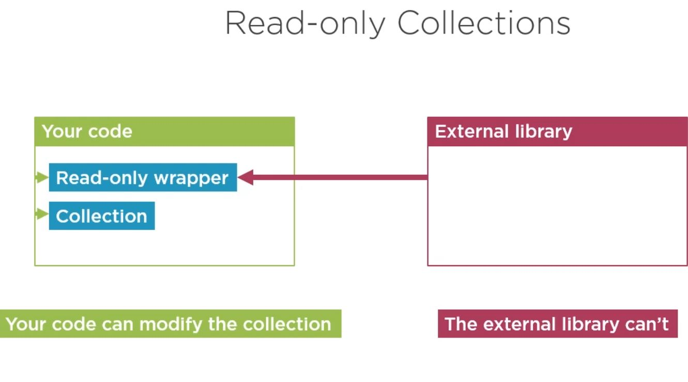
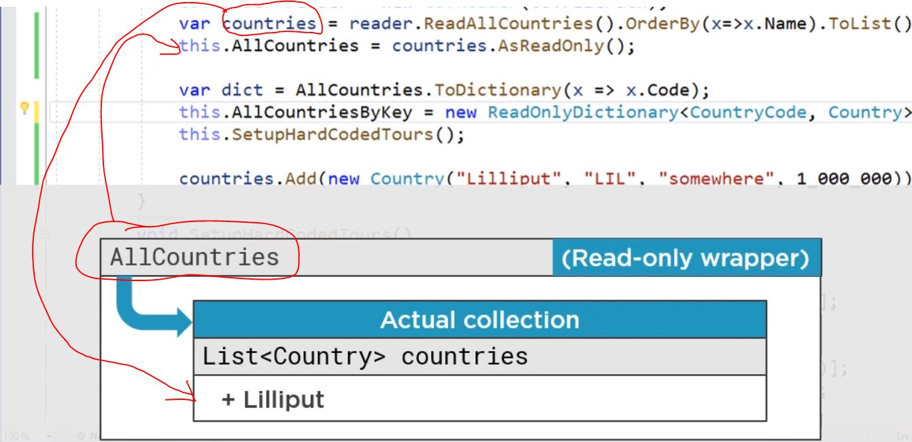
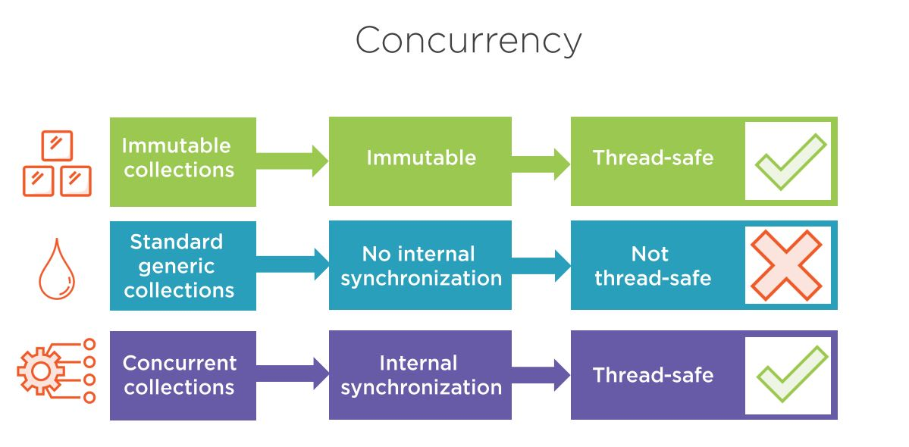
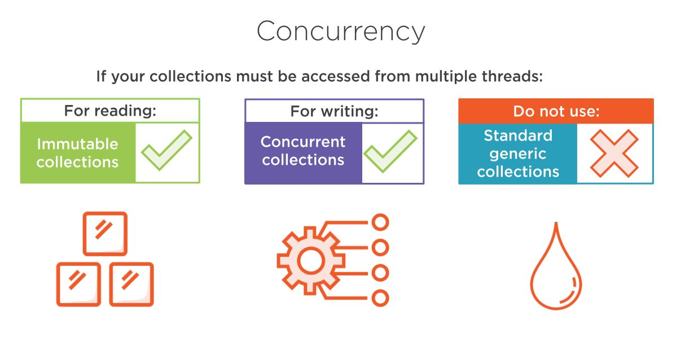

# Concurrency and ConcurrentCollections

## Concurrency
```
Concurrent collection don`t always function the same way as 
their standart equivalents. Thread safe alternative to standard collections
But concurrency enforces differences in logic
```
```c#
public ConcurrentQueue<(Customer TheCustomer, Tour TheTour)> BookingRequestsMultiThread { get; }
			= new ConcurrentQueue<(Customer, Tour)>();
public Queue<(Customer TheCustomer, Tour TheTour)> BookingRequests { get; }
			= new Queue<(Customer, Tour)>();

if (AllData.BookingRequests.Count == 0)
	return;
//Sync environment, this is work fine but the logic behind Dequeue() doesn`t
//work in a multi-threaded environment
var request = AllData.BookingRequests.Dequeue();	
//BookingRequestsMultiThread.Dequeue(); not working, another thread could modify
//the dequeue as soon as AllData.BookingRequests.Count return

bool success = AllData.BookingRequestsMultiThread.TryDequeue(out var request);
if(success)
{
	request.DoSomethingWithRequest;
}
```
 


## ReadOnlyCollection
```
Read-only collections can be modified - if you have a reference to the underlying collection

and ReadOnlyCollection<T> objects does not expose methods that modify the collection.
```



## Immutable collections
> Can circumvent with reflection or unmanaged code
> Protect against accidental modifications(not malicious code)


## Sumarry


